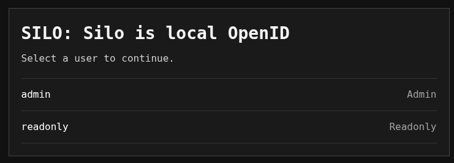

# silo

> SILO: Silo is local OpenID

`silo` is a local OpenID mock backend.

It is aimed at local development and test scenarios where you need:

- a browser-based OpenID authorization code flow
- a JWKS endpoint for JWT validation
- a simple `client_credentials` client for fetching tokens from Silo or a real issuer

## Browser flow

The browser-based authorization flow includes a built-in user picker:



The code exchange returns signed ID and access tokens. Silo does not issue refresh tokens.

## Features

- OpenID discovery at `/Silo/.well-known/openid-configuration`
- authorization endpoint at `/Silo/oauth2/authorize`
- token endpoint at `/Silo/oauth2/token`
- JWKS at `/Silo/jwks.json`
- RS256 ID tokens and access tokens for the authorization-code flow
- standard OAuth error redirects for valid clients and redirect URLs
- configurable mock users from YAML
- interactive user chooser for browser flow
- optional `--sub` to preselect one mock user
- `client_credentials` mode for fetching remote access tokens and printing them to stdout

## Install or run with nix

```bash
nix profile add github:hencjo/silo
```

Run silo directly from the flake without installing it:

```bash
nix run github:hencjo/silo -- example-config > config.yaml
nix run github:hencjo/silo -- serve --port 9799 --config-file config.yaml &
```

In another shell:
```bash
CLIENT_ID=system-api CLIENT_SECRET=client_secret \
  nix run github:hencjo/silo -- client_credentials --issuer-url http://localhost:9799/Silo
```

## Quick Start

Generate a starter config:

```bash
silo example-config > config.yaml
```

```bash
silo serve --port 9799 --config-file config.yaml
```

Fetch a local `client_credentials` token from the running server:

```bash
CLIENT_ID=system-api CLIENT_SECRET=client_secret \
  silo client_credentials --issuer-url http://localhost:9799/Silo
```

## Config

The server reads a YAML file with:

- `clients` for OAuth clients and optional `client_credentials` token claims
- `authorization_code.subs` for selectable browser-flow users
- `authorization_code: {}` to disable the browser flow entirely
- optional `key_file` for sharing one signing key across restarts or Silo instances

Example:

```yaml
# Optional; relative paths resolve from this config file.
# key_file: ./silo-private-key.pem
clients:
  relying-party:
    client_secret: client_secret
  system-api:
    client_secret: client_secret
    givenName: System
    defaultName: System API
    claims:
      groups:
        - admin
authorization_code:
  subs:
    sub1:
      givenName: Mock
      defaultName: Mock User
      claims:
        preferred_username: mock
        groups:
          - admin
    sub2:
      givenName: Admin
      defaultName: Admin User
      claims:
        groups:
          - auditor
        email: admin@example.com
```

Notes:

- `givenName` and `defaultName` are emitted in the ID token.
- The user picker shows a non-empty string `claims.preferred_username` followed by the stable `sub`; otherwise it shows `sub` alone.
- Each key under `claims` becomes a claim in issued JWTs, with the original YAML value preserved.
- Without `key_file`, Silo creates a fresh temporary signing key for each run.
- A missing configured `key_file` is generated once and then reused. Its `kid` is derived from the public key.
- All entries under `clients` are OAuth clients, and any configured client can use either flow.
- For `client_credentials`, `givenName`, `defaultName`, and `claims` are optional per client. If omitted, Silo still mints a valid token with `sub=<client_id>`.

## License

Apache-2.0. See [`LICENSE`](./LICENSE).
